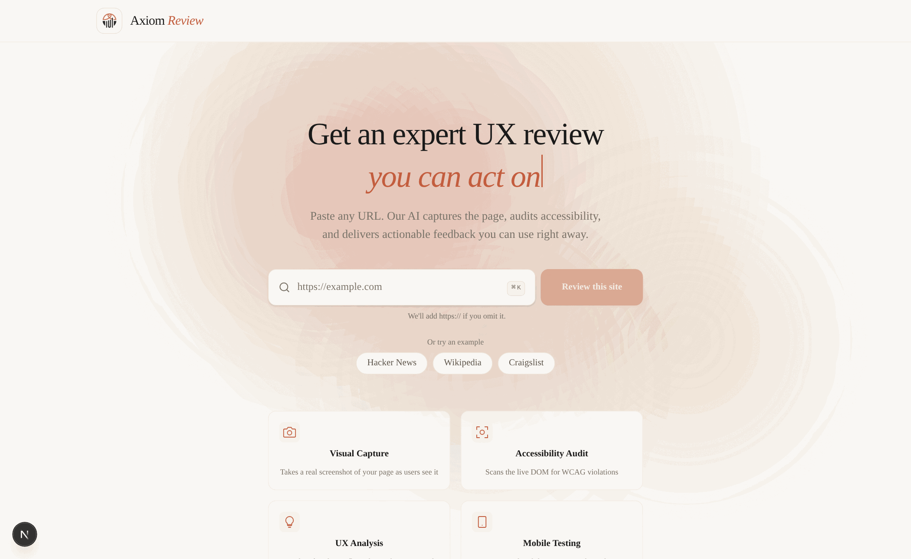

# Axiom Review

**Paste a URL, get a grounded UX + accessibility review.** A real browser visits the page,
audits the live DOM, screenshots it on desktop and mobile, and Claude turns that evidence into
a scored report with element-level screenshots, suggested fixes and a PDF export.




## Why it isn't "just ask an LLM"

Sending a screenshot to a vision model and asking "what's wrong with this page?" gives you
confident, generic answers. Axiom Review is built around the opposite idea: **the model
only gets to argue from evidence it was handed.**

1. **Playwright loads the page** in headless Chromium (1280×900, then again at 390×844 for
   mobile), with `navigator.webdriver` masked and a settle-wait for JS-heavy pages.
2. **A DOM audit runs inside the page** and extracts concrete accessibility signals:
   images without `alt`, inputs without an associated `<label>`/`aria-label`, interactive
   elements with no accessible name, heading order, duplicate `id`s, links with no text,
   `aria-invalid` elements. On mobile: viewport meta, touch targets under 44×44 px, body
   font size, elements overflowing the viewport.
3. **Claude receives screenshot + extracted text + the audit** with a system prompt that
   tells it the audit is ground truth, asks for 2–4 UX issues and 2–4 accessibility findings,
   and requires a **CSS selector** for every finding it can localise.
4. **Each selector is re-resolved in the still-open browser** and screenshotted with padding,
   so every finding in the report is pinned to a picture of the actual element. Selectors
   that don't resolve are dropped rather than shown.
5. Scores (accessibility / clarity / usability / overall, 0–100), issues and findings are
   rendered in the UI; a second endpoint (`/api/generate-fixes`) turns the report into a
   **fix playground** — before/after copy for hero, CTA and forms, a prioritised change list
   with impact/effort, and quick wins — and `jsPDF` exports the whole thing.

Model output is parsed as strict JSON with runtime type guards; malformed responses fall
back to a deterministic report instead of crashing the UI.

## Stack

- **Next.js 16** (App Router, Route Handlers) · **React 19** · **TypeScript** · **Tailwind v4**
- **Playwright** (Chromium) for capture and in-page DOM evaluation
- **Anthropic SDK** — Claude with vision input, JSON-only output
- **jsPDF** for client-side PDF export

## Run it

```bash
git clone https://github.com/Nikohtr/axiom-review.git
cd axiom-review
npm install
npx playwright install chromium     # one-time, ~150 MB
cp .env.example .env.local          # then add your ANTHROPIC_API_KEY
npm run dev                          # http://localhost:3000
```

Analysis takes 20–60 s per URL depending on the page (two full browser visits plus
two model calls). Screenshots are written to `public/screenshots/` (git-ignored).

## Layout

```
app/
  page.tsx                   client state machine: idle → loading → success | error
  api/analyze/route.ts       Playwright capture, DOM audit, Claude call, element screenshots, mobile pass
  api/generate-fixes/route.ts  report → fix playground (typed, validated, with fallback)
components/
  ReportView.tsx             report + Report/Issue/Finding types
  IssueCard.tsx, AccessibilityList.tsx, FixPlayground.tsx, ExportButton.tsx, …
lib/generatePdf.ts           jsPDF export
types/fixPlayground.ts       fix-playground contract
```

## Limitations / next steps

- The DOM audit is a curated set of high-signal checks, not a full WCAG engine; wiring in
  `axe-core` would widen coverage.
- Colour contrast is judged visually by the model, not computed.
- Single-page only; no crawling or auth flows.
- No test suite yet.

## License

MIT — see [LICENSE](LICENSE).
